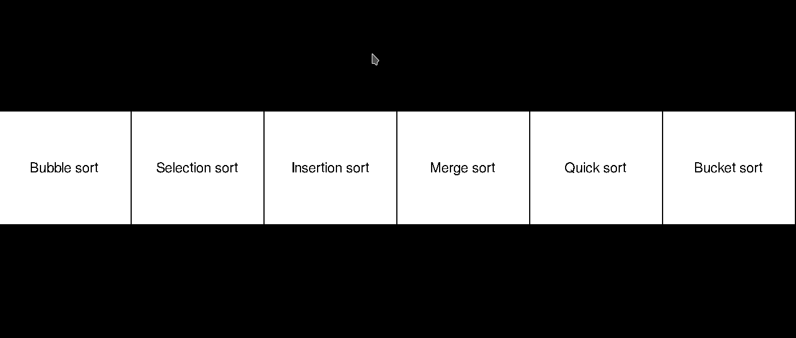

# Sorting algorithm visualizer
Visualize various sorting algorithms. Written in C++ using SDL2.

Example of the program visualizing *merge sort*.

Implemented sorting algorithms:  
- Quick sort
- Merge sort
- Bucket sort
- Insertion sort
- Selection sort
- Bubble sort

Build using `make`.
Run using `./sorter`.

Requires [SDL2](https://www.libsdl.org/) and [SDL2_TTF](https://www.libsdl.org/projects/SDL_ttf/).
